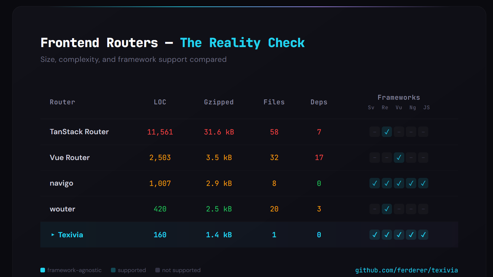

# Texivia

**3 kB router. Zero dependencies. Any framework.**

From Latin *textor* (weaver) + *via* (road) — "path weaver."



[](https://bundlephobia.com/package/texivia-router)
[](https://www.npmjs.com/package/texivia-router)
[](https://www.typescriptlang.org/)
[](https://opensource.org/licenses/Apache-2.0)

```
npm install texivia-router
```

## Why Texivia?

|         | TanStack | Vue Router | navigo | wouter | **Texivia** |
|---------|--------:|-----------:|-------:|-------:|------------:|
| LOC     |  11,561 |  2,503 | 1,007 | 420 | **160** |
| Gzipped | 31.6 kB | 3.5 kB | 2.9 kB | 2.5 kB | **1.4 kB** |
| Files   |      58 |     32 | 8 | 20 | **1** |
| Deps    |       7 | 17 | 0 | 3 | **0** |
| Svelte  |       – | – | ✓ | – | **✓** |
| React   |       ✓ | – | ✓ | ✓ | **✓** |
| Vue     |       – | ✓ | ✓ | – | **✓** |
| Angular |       – | – | ✓ | – | **✓** |
| Vanilla |       – | – | ✓ | – | **✓** |

Texivia compiles all routes into a single regex at startup. Matching is a single `exec()` call — O(1) regardless of route count.

## Quick Start

```typescript
import { Router } from 'texivia-router';

const router = new Router([
  { path: '/', view: Home },
  { path: '/recipe/{id}', view: RecipeDetail },
  { path: '*', view: NotFound }
]);

router.start();

document.addEventListener('texivia', (e) => {
  const { view, params, search, hash } = e.detail;
  // render your app — view is whatever you put in the config
});
```

That's it. No providers, no wrappers, no context.

## Svelte 5

Extract the router into its own module so any component or service can import it:

```typescript
// src/router.ts
import { Router } from 'texivia-router';
import type { Component } from 'svelte';
import Home from './pages/Home.svelte';
import RecipeDetail from './pages/RecipeDetail.svelte';
import NotFound from './pages/NotFound.svelte';

export const router = new Router<Component<any>>([
  { path: '/', view: Home },
  { path: '/recipe/{id}', view: RecipeDetail },
  { path: '*', view: NotFound },
]);
```

```svelte
<!-- App.svelte -->
<script lang="ts">
  import { onMount } from 'svelte';
  import { router } from './router';

  let View = $state(null);
  let params = $state({});

  function onNavigate(event: CustomEvent) {
    View = event.detail.view;
    params = event.detail?.params || {};
  }

  onMount(() => {
    router.start();
    document.addEventListener('texivia', onNavigate as EventListener);
    return () => {
      router.stop();
      document.removeEventListener('texivia', onNavigate as EventListener);
    };
  });
</script>

{#if View}
  <View {...params} />
{/if}
```

The `view` property holds the Svelte component directly — no string-to-component lookup. `Router<Component<any>>` gives you full type safety across the config.

No `<Link>` components. Plain `<a>` tags just work — Texivia intercepts relative links automatically. For programmatic navigation, import the router:

```typescript
// anywhere — a service, a handler, another component
import { router } from './router';
router.navigate('/dashboard');
```

### Nested layouts

Texivia doesn't need a nested routing concept. Use your framework's composition instead:

```svelte
<!-- pages/RecipeDetail.svelte -->
<script lang="ts">
  import Layout from '../components/layout/Layout.svelte';
  const { id } = $props();
</script>

<Layout>
  {#snippet body()}
    <h1>Recipe #{id}</h1>
    <!-- page content -->
  {/snippet}
</Layout>
```

Layouts are components, not router config. This keeps the router simple and your layouts flexible.

## Vue 3

```typescript
// src/router.ts
import { Router } from 'texivia-router';
import type { Component } from 'vue';
import Home from './pages/Home.vue';
import RecipeDetail from './pages/RecipeDetail.vue';
import NotFound from './pages/NotFound.vue';

export const router = new Router<Component>([
  { path: '/', view: Home },
  { path: '/recipe/{id}', view: RecipeDetail },
  { path: '*', view: NotFound },
]);
```

```vue
<!-- App.vue -->
<script setup lang="ts">
import { shallowRef, ref, onMounted, onUnmounted } from 'vue';
import { router } from './router';
import Home from './pages/Home.vue';

const View = shallowRef(Home);
const params = ref<Record<string, string>>({});

function onNavigate(event: Event) {
  const detail = (event as CustomEvent).detail;
  View.value = detail.view;
  params.value = detail?.params || {};
}

onMounted(() => {
  router.start();
  document.addEventListener('texivia', onNavigate);
});

onUnmounted(() => {
  router.stop();
  document.removeEventListener('texivia', onNavigate);
});
</script>

<template>
  <component :is="View" v-bind="params" />
</template>
```

Same pattern — shared `router.ts`, import where you need `router.navigate()`.

## Features

**Compiled regex matching** — All routes become one regex. One `exec()` per navigation, regardless of route count.

**Framework-agnostic** — Works with Svelte, Vue, React, or vanilla JS. No adapters, no plugins. Standard DOM events in, DOM events out.

**Type-safe** — Generic `Router<T>` lets you type your view data. Route configs, matched routes, and handler signatures are fully typed.

**Dynamic parameters with constraints** — `{id}` matches any segment. `{id:\\d+}` matches only digits. `{slug:[a-z-]+}` matches only lowercase slugs. Full regex power per segment.

**Async navigation handlers** — Per-route `handler` functions run before navigation. Return `true` to proceed, `false` to cancel, or a string to redirect. Supports async/await for auth checks, data loading, or analytics.

```typescript
const router = new Router([
  {
    path: '/dashboard',
    view: 'Dashboard',
    handler: async (match) => {
      if (!await isAuthenticated()) return '/login';
      await preloadData(match.params);
      return true;
    }
  }
]);
```

**Automatic link interception** — Clicks on relative `<a>` tags are captured and routed. External links, `target="_blank"`, `download`, and `no-router` attributes are ignored. No special link components needed.

```html
<a href="/recipes/42">Recipe</a>        <!-- intercepted -->
<a href="https://example.com">Ext</a>   <!-- ignored: external -->
<a href="/file.pdf" download>PDF</a>    <!-- ignored: download -->
<a href="/raw" no-router>Raw</a>        <!-- ignored: opt-out -->
```

**Declarative redirects** — `{ path: '/old', redirect: '/new' }` in the config. No imperative redirect logic needed.

**Catch-all 404** — `{ path: '*' }` matches anything not matched by other routes. Place it last in your config.

**Event-driven** — Every navigation dispatches a `texivia` CustomEvent on `document` with full route detail: `view`, `params`, `search`, `hash`.

**Programmatic navigation** — Call `router.navigate()` from anywhere:

```typescript
router.navigate('/recipes/42');
router.navigate('/search?q=pasta#results');
```

**History API** — Uses `pushState`/`popstate` for clean URLs. No hash routing.

**Nesting through composition** — No nested route config. Use your framework's own layout/slot/snippet system. The router stays flat, your component tree stays flexible.

## API

### `new Router<T>(config)`

Creates a router instance. `config` is an array of route objects:

```typescript
type ConfigRoute<T> = {
  path: string;
  view?: T;
  redirect?: string;
  handler?: (match: MatchedRoute<T>) => string | boolean | Promise<string | boolean>;
};
```

- `path` — URL pattern. Literal segments, `{param}` or `{param:regex}` for dynamic segments, `*` for catch-all.
- `view` — The view or component to render for this route.
- `redirect` — Target path for redirects.
- `handler` — Async or sync function called before navigation. Return `true` to proceed, `false` to cancel, or a string to redirect.

### `router.start(): Promise<void>`

Starts the router. Attaches `popstate`, `click`, and `texivia.goto` listeners. Navigates to the current URL.

### `router.stop(): void`

Removes all event listeners. Call on cleanup.

### `router.navigate(path): Promise<MatchedRoute<T> | null>`

Navigates to the given path. Runs handlers, pushes history state, and dispatches the `texivia` event. Returns the matched route or `null` if no route matches.

```typescript
await router.navigate('/recipe/42');
await router.navigate('/search?q=pasta#results');
```

### Event: `texivia`

Dispatched on `document` after each successful navigation.

```typescript
type MatchedRoute<T> = {
  path: string;
  view?: T;
  params: Record<string, string>;
  search: Record<string, string>;
  hash: string;
};

document.addEventListener('texivia', (e: CustomEvent<MatchedRoute<T>>) => {
  const { view, params, search, hash } = e.detail;
});
```

## Testing

Tested with [Vitest](https://vitest.dev/) covering route matching, navigation, handlers, redirects, link interception, and edge cases.

```bash
npm test
```

## License

[Apache 2.0](LICENSE)
